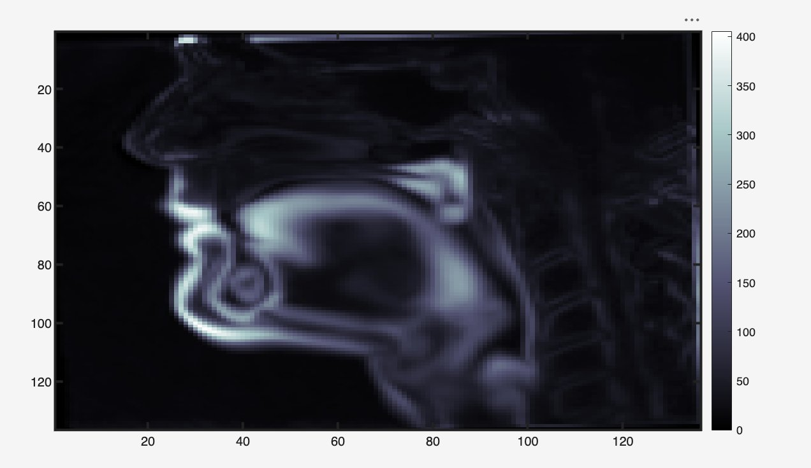
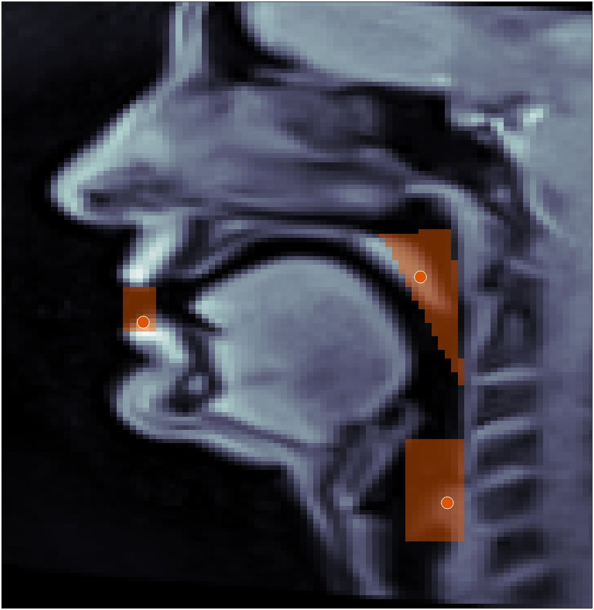
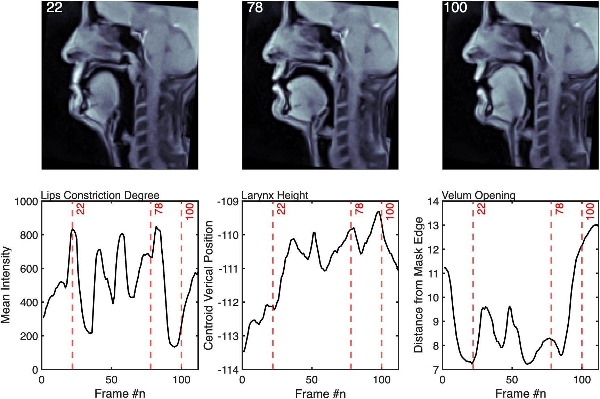
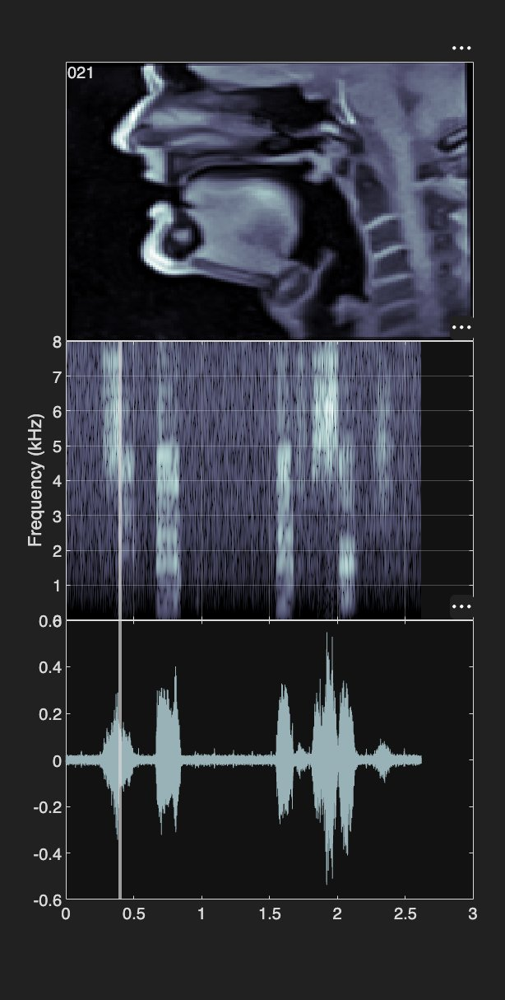
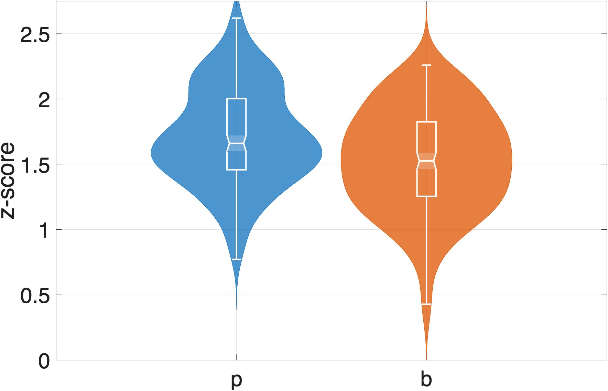
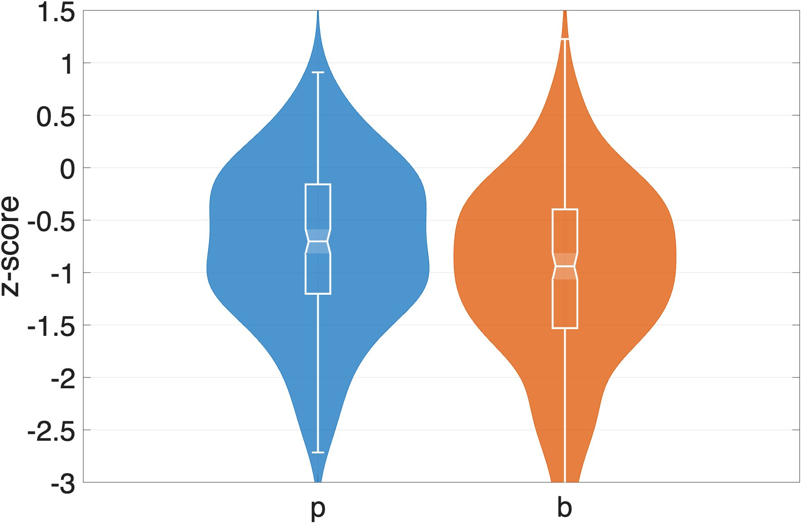
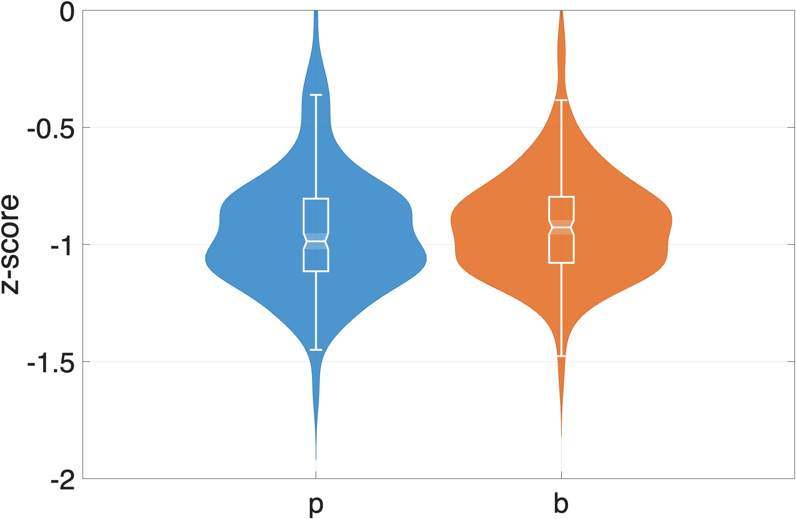

# MRIUtils

**A modular MATLAB toolbox for real-time MRI vocal tract analysis**

*Francesco Burroni — Institute for Phonetics and Speech Processing, LMU München*

---

MRIUtils is a clean, modular MATLAB pipeline for the analysis of real-time MRI (rtMRI) speech data. It provides tools for building MRI tensors, computing variance-based standard deviation maps, interactive ROI drawing, articulator trajectory extraction, and visualization — designed with software engineering principles that are often absent from existing rtMRI toolboxes.

The toolbox is organized around a single `results` struct that accumulates outputs across pipeline stages, making it easy to inspect, save, and extend at any point.

> **This toolbox is under active development.** The current release covers the core ROI-based analysis pipeline. Additional modules — including semi-polar grid aperture functions, whole-image PCA/NMF decomposition, and a Python layer with SAM 3 automatic segmentation — are planned for future releases.

---

## Input data structure

All pipeline entry points take a **struct array `S`**, where each element represents one trial (token). The required and optional fields are:

```matlab
S(k).mri       % [H × W × nFrames] uint16 or double — MRI tensor for trial k
               %   H, W     : image height and width in pixels (e.g. 136 × 136)
               %   nFrames  : number of frames in this trial (can vary across trials)

S(k).mriFs     % scalar double — MRI frame rate in Hz (e.g. 50.05)
```

These two fields are required by `computeMRIStd` and `buildMRITensor`.

`displayMRI` additionally requires:

```matlab
S(k).audio     % [nSamples × 1] double — noise-suppressed audio signal
S(k).audioFs   % scalar double — audio sampling rate in Hz
```

**Example — minimal valid S for the core pipeline:**

```matlab
S(1).mri   = rand(136, 136, 120, "uint16");  % trial 1: 120 frames
S(1).mriFs = 50.05;

S(2).mri   = rand(136, 136, 95, "uint16");   % trial 2: 95 frames
S(2).mriFs = 50.05;

results = computeMRIStd(S, flipud=true);
```

Trials do not need to have the same number of frames — `buildMRITensor` handles variable-length trials by concatenating along the frame dimension.

Any additional fields present in `S` (e.g. TextGrid tiers, speaker metadata) are ignored by the pipeline functions and can be appended to `results` manually after extraction.

---

## Pipeline

```
computeMRIStd  →  drawMRIMask  →  extractROIProperties  →  inspectMRIProperties
                                                         →  inspectMRITracking
```

All core functions take and return the same `results` struct. `buildMRITensor` and `displayMRI` are standalone utilities.

---

## Gallery

### Pixel-wise standard deviation map
`computeMRIStd` computes the std across all frames and tokens. High-variance pixels trace articulatorily active air-tissue boundaries — tongue body, velum, larynx, lips — making the std map a natural guide for semi-automatic mask placement.



### ROI masks and centroid tracking
`drawMRIMask` overlays ROI masks (orange) on the MRI frame. `extractROIProperties` tracks the intensity-weighted centroid (circular markers) within each ROI frame by frame. Three ROIs are shown: lips (left), velum (upper right), larynx (lower right).



### Articulatory trajectories with synchronized MRI frames
Example trajectories extracted by `extractROIProperties` from a single trial, with three representative MRI frames at corresponding time points. Left: Lip Constriction Degree (mean intensity); Center: Larynx Height (centroid vertical position); Right: Velum Opening (aperture). Trajectories are in raw units prior to z-scoring.



### Synchronized MRI, spectrogram and waveform
`displayMRI` renders an animated figure showing the MRI frame alongside the spectrogram and waveform, synchronized in time, and writes the result to a video file.



### Group-level outputs — Québec French voicing contrast
Z-scored peak values extracted across 400 tokens from 10 QF speakers, used to study the voiced/voiceless bilabial stop contrast (/b/ vs /p/). Burroni & Riverin-Coutlée (in prep.).

| Lip Constriction Degree | Larynx Height | Velopharyngeal Aperture |
|:-:|:-:|:-:|
|  |  |  |

---

## Functions

### `computeMRIStd(S, opts)` — *entry point*
Builds the MRI tensor and computes the pixel-wise standard deviation map. Initializes the `results` struct.

**Input:** struct array `S` where each element has a `.mri` field (H × W × nFrames)

**Key options:**
| Option | Type | Default | Description |
|---|---|---|---|
| `flipud` | logical | `false` | Flip frames vertically before processing |
| `colorMap` | string | `"bone"` | Colormap for std map display |
| `fName` | string | `""` | If provided, save figure and close; otherwise interactive |

**Output fields:**
```matlab
results.MRIC     % {1 × nTrials} cell array of MRI tensors — source of truth
results.MRI      % H × W × nTotalFrames concatenated tensor
results.MRIStd   % H × W pixel-wise standard deviation map
results.MRIFs    % frame rate vector across trials
```

---

### `drawMRIMask(results, opts)` — *interactive*
Displays the first MRI frame fused with the std map as a falsecolor overlay and prompts the user to draw an ROI. Loops until the user confirms. For velum masks, automatically computes the pharyngeal reference point as the top-right corner of the mask bounding box.

**Key options:**
| Option | Type | Default | Description |
|---|---|---|---|
| `maskName` | string | `"noName"` | Label for the mask; used as field name in `results.masks` |
| `maskType` | string | `"rectangle"` | `"rectangle"`, `"polygon"`, `"ellipse"`, `"circle"` |

**Output fields:**
```matlab
results.masks.(maskName).array          % H × W logical mask
results.masks.(maskName).name           % string label
results.masks.(maskName).type           % ROI type
results.masks.(maskName).pharyngealRef  % [x, y] reference point (velum only)
```

---

### `extractROIProperties(results, opts)`
For each trial in `results.MRIC`, loops over frames and extracts three articulatory measures from the named ROI:

- **Mean intensity** — mean pixel value within the mask. Lower values indicate more air (greater constriction). Primary measure for lip closure.
- **Intensity-weighted centroid** — center of mass of pixel intensities within the mask. Tracks articulator position over time. Primary measure for larynx height.
- **Velopharyngeal aperture** *(velum mask only)* — Euclidean distance from velum centroid to `pharyngealRef`, approximating the velopharyngeal port opening.

When a mask contains multiple connected components, the function selects the most anatomically appropriate one: rightmost for larynx and velum, largest by area for lips.

**Key options:**
| Option | Type | Default | Description |
|---|---|---|---|
| `maskName` | string | `"noName"` | Which mask to extract from |
| `rescaleFactor` | double | `1` | Spatial rescaling applied to frames |
| `doPlot` | logical | `false` | Frame-by-frame centroid overlay during processing |

**Output fields:**
```matlab
results.masks.(maskName).meanInt{k}   % [nFrames × 1] mean intensity, trial k
results.masks.(maskName).centroid{k}  % [nFrames × 2] centroid [x, y], trial k
results.masks.(maskName).aperture{k}  % [nFrames × 1] aperture, trial k (velum only)
```

---

### `inspectMRIProperties(results, opts)` — *visualization, under development*
Animated playback of all trials with mask overlays and centroid markers updating per frame. Useful for quality-checking trajectory extraction.

---

### `inspectMRITracking(S, results, opts)` — *visualization, under development*
`uifigure`-based interactive frame inspector with a slider for manual navigation through the concatenated MRI tensor.

---

### `buildMRITensor(S, opts)` — *utility*
Concatenates per-trial MRI tensors from a struct array into a single H × W × nTotalFrames tensor.

| Option | Type | Default | Description |
|---|---|---|---|
| `flipud` | logical | `false` | Flip frames vertically |

---

### `displayMRI(S, opts)` — *utility, under development*
Displays synchronized MRI animation alongside spectrogram and waveform, and writes output to an AVI video file.

---

## Data structure

```matlab
results.MRIC                              % {1 × nTrials} MRI tensors
results.MRI                               % H × W × nTotalFrames tensor
results.MRIStd                            % H × W std map
results.MRIFs                             % frame rates
results.masks.(maskName).array            % H × W logical mask
results.masks.(maskName).name             % string label
results.masks.(maskName).type             % ROI type
results.masks.(maskName).pharyngealRef    % [x, y] pharyngeal ref (velum only)
results.masks.(maskName).meanInt{k}       % mean intensity, trial k
results.masks.(maskName).centroid{k}      % centroid, trial k
results.masks.(maskName).aperture{k}      % aperture, trial k (velum only)
```

TextGrid tiers can be appended after extraction:
```matlab
for k = 1:numel(tierNames)
    results.(tierNames(k)) = {S.(tierNames(k))};
end
```

---

## Typical usage

```matlab
% Entry point
results = computeMRIStd(S, flipud=true);

% Draw ROIs interactively
results = drawMRIMask(results, maskName="lips",   maskType="rectangle");
results = drawMRIMask(results, maskName="velum",  maskType="polygon");
results = drawMRIMask(results, maskName="larynx", maskType="rectangle");

% Extract trajectories
results = extractROIProperties(results, maskName="lips");
results = extractROIProperties(results, maskName="velum");
results = extractROIProperties(results, maskName="larynx");

% Inspect
inspectMRIProperties(results)
inspectMRITracking(S, results)

% Save
save(fName, "results")
```

---

## Requirements

- MATLAB R2021b or later (`arguments` block syntax and named arguments)
- Image Processing Toolbox (`regionprops`, `drawrectangle`, `drawpolygon`, `imresize`)

---

## Roadmap

- [ ] Semi-polar grid analysis
- [ ] Aperture function extraction and cross-speaker normalization
- [ ] Whole-image PCA/NNMF decomposition
- [ ] Python layer

---

## Citation

If you use MRIUtils in your research, please cite:

```
Burroni, F. (2026). MRIUtils: A modular MATLAB toolbox for real-time MRI 
vocal tract analysis. GitHub: https://github.com/francescoburroni/MRIUtils
```

A methods paper is in preparation.

---

## Empirical applications

The rtMRI data used in developing and testing this toolbox were collected as part of DFG project 520195671 Nasality, Length and Diphthongization in Québec French: An MRI Study (PI: Josiane Riverin-Coutlée, IPS LMU München).
First empirical application:
Burroni, F. & Riverin-Coutlée, J. (in prep.). Voicing as a whole-vocal-tract articulation: Evidence from real-time MRI of Québec French bilabial stops

---

## License

Apache License 2.0. See `LICENSE` for details.

---

## Acknowledgments
Developed at the Institute for Phonetics and Speech Processing, Ludwig-Maximilians-Universität München, in the Spoken Language Processing Group (Chair: Prof. James Kirby). The rtMRI data used in testing this toolbox were collected as part of DFG project 520195671 Nasality, Length and Diphthongization in Québec French: An MRI Study (PI: Josiane Riverin-Coutlée), and recorded at the Max Planck Institute for Multidisciplinary Sciences, Göttingen, in collaboration with Jens Frahm and Dirk Voit. Pre-processing scripts and general infrastructure developed by Philip Hoole (IPS LMU München) were used in earlier stages of the data preparation pipeline.
